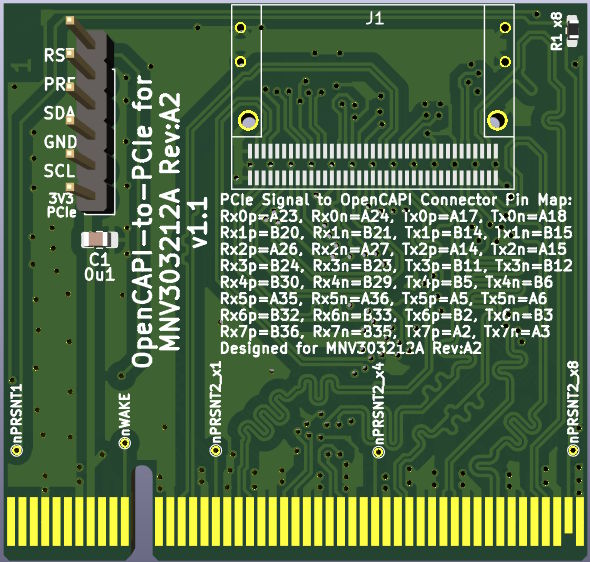
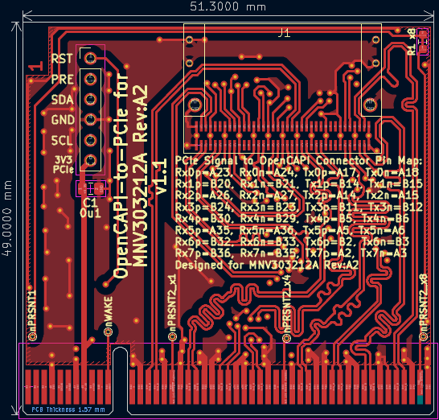
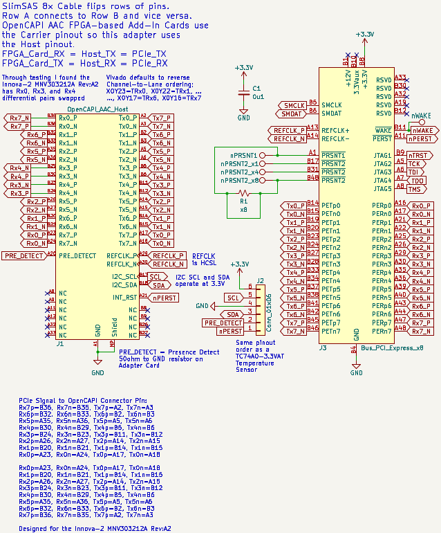

**Work-In-Progress**: Notes need updating. v1.1 Gerbers need to be manufactured and tested.

# PCIe to Innova-2 MNV303212A RevA2 SlimSAS8x

This is a variant of the [OpenCAPI-to-PCIe](https://github.com/mwrnd/OpenCAPI-to-PCIe) project optimized for the **Innova-2 MNV303212A Rev:A2**.

The [Open Coherant Accelerator Processor Interface (OpenCAPI)](https://opencapi.org/wp-content/uploads/2022/07/OpenCAPI-Overview.pdf) [was a standard](https://opencapi.org/2022/08/09/cxl-consortium-and-opencapi-consortium-sign-letter-of-intent-to-transfer-opencapi-specifications-to-cxl/) that had FPGA-based [Advanced Accelerated Cable (AAC)](https://files.openpower.foundation/s/xSQPe6ypoakKQdq/download/25Gbps-spec-20171108.pdf) [Add-In cards](https://opencapi.org/wp-content/uploads/2018/12/OpenCAPI-Tech-SC18-Exhibitor-Forum.pdf) such as [ADM-PCIE-9H3](https://www.alpha-data.com/product/adm-pcie-9h3/), [ADM-PCIE-9H7](https://www.alpha-data.com/alpha-data-release-adm-pcie-9h7-data-center-board-with-xilinx-virtex-ultrascale-hbm-fpga/), [ADM-PCIE-9V3](https://www.alpha-data.com/product/adm-pcie-9v3/), [ADM-PCIE-9V5](https://www.alpha-data.com/product/adm-pcie-9v5/), [BittWare XUP-VV4](https://www.bittware.com/fpga/xup-vv4/), [BittWare XUP-VVH](https://www.bittware.com/fpga/xup-vvh/), and [Nvidia Innova-2 Flex SmartNIC](https://www.nvidia.com/en-us/networking/ethernet/innova-2-flex/).

The OpenCAPI interface is based on [PCI-Express](https://en.wikipedia.org/wiki/PCI_Express) and uses a [SlimSAS 8X](https://en.wikipedia.org/wiki/Serial_Attached_SCSI) (SFF-8654) Connector. This adapter enables connecting an OpenCAPI FPGA board to a host using PCIe over a SlimSAS cable.

## PCB Layout

4-Layer PCB. Inner 2 layers are GND planes. Differential pair are matched to a length of 61mm +/- 1mm both inter-pair and intra-pair (N-to-P).

## Schematic

Note the reverse channel ordering and swapped `_P` and `_N` for RX3, 4, and 7. This is done to optimize for the `MNV303212A-ADLT Rev:A2` board.

## Design Notes

Only a single component is required for the adapter, a [U10A474200T](https://www.digikey.com/en/products/detail/amphenol-cs-commercial-products/U10A474200T/14632855)/[U10A474240T](https://www.digikey.com/en/products/detail/amphenol-cs-commercial-products/U10A474240T/17066204) SlimSAS 8x Right-Angle SMD Connector. A SlimSAS 8x Cable such as the [3M 8ES8-1DF21](https://www.trustedparts.com/en/search/8ES8-1DF21)([Datasheet](https://multimedia.3m.com/mws/media/1398233O/3m-slimline-twin-ax-assembly-sff-8654-x8-30awg-78-5100-2665-8.pdf)) is required to use the adapter with an OpenCAPI FPGA Board.

Resistor **R1** is shorted to connect `nPRSNT1` to `nPRSNT2_x8`. The trace can be scratched off and `nPRSNT1` can be connected to `nPRSNT2_x1` or `nPRSNT2_x4`.

### PCB Stackup

I am using values from [JLCPCB](https://jlcpcb.com/capabilities/pcb-capabilities).

### Trace Impedance Control

OpenCAPI uses 85ohm impedance cables. I played with the values until I got the loosest differential pair coupling that is manufacturable with larger tolerances.

## Testing

The [innova2_xdma_opencapi](https://github.com/mwrnd/innova2_xdma_opencapi) project is designed to test this `OpenCAPI-to-PCIe for MNV303212A RevA2` Adapter using an [Innova2 Flex SmartNIC Rev:A2 board](https://github.com/mwrnd/innova2_flex_xcku15p_notes).

The Innova2 SmartNIC's XCKU15P FPGA does not have its Configuration Block in the same column as the OpenCAPI GTY transceivers so it is impossible to configure the FPGA within the [PCIe Specification's 100ms time limit](https://pcisig.com/specifications/ecr_ecn_process?speclib=100+ms).

Motherboard boot must be delayed to allow the FPGA to configure itself before PCIe devices are enumerated by the host system. This can be accomplished by toggling the POWER button, then pressing and holding the RESET button for a second before releasing it. Or, [connect a capacitor across the reset pins of an ATX motherboard's Front Panel Header](https://github.com/mwrnd/ATX_Boot_Delay):

Using a [3M 8ES8-1DF21-0.75](https://www.trustedparts.com/en/search/8ES8-1DF21-0.75) cable:

PCIe Link Status is usually excellent:

Using an [SFPCables.com SFF-8654 to SFF-8654 8i](https://www.sfpcables.com/24g-internal-slimsas-sff-8654-to-sff-8654-8i-cable-straight-to-90-degree-left-angle-8x-12-sas-4-0-85-ohm-0-5-1-meter) cable:

PCIe Link Status is downgraded:

### Additional OpenCAPI Signals

Additional useful signals from the OpenCAPI connector are routed to a 6x1 0.1" Header. The pinout matches a [TC74 I2C Temperature Sensor](https://www.microchip.com/en-us/product/tc74). Note 3.3V is from the PCIe connector. **PRE** is a Presence Detect pin which is connected to GND via a 50-Ohm resistor on the OpenCAPI AAC Add-In card (the Innova-2). **RST** is connected to PCIe/OpenCAPI RESET.

The [innova2_xdma_opencapi](https://github.com/mwrnd/innova2_xdma_opencapi) project features the ability to [test](https://github.com/mwrnd/innova2_xdma_opencapi/blob/main/README.md#opencapi-i2c-over-xdma) a TC74Ax-3.3VAT in an OpenCAPI-to-PCIe Adapter.

